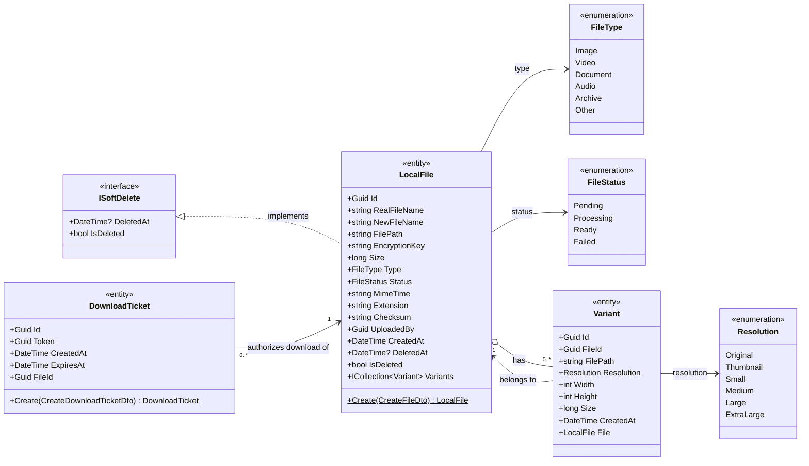

# Files Processor — Class Diagram

> Render this file in an editor/viewer that supports the **Mermaid** extension
> (e.g. VS Code *Markdown Preview Mermaid Support*, GitHub, GitLab, Notion).

## Notes

- **LocalFile** holds the metadata of an uploaded, encrypted file (the entity was
  renamed from `File` to `LocalFile` to avoid clashing with `System.IO.File`).
  One file can have many **Variants** (e.g. resized images / transcoded
  renditions). It implements **ISoftDelete** for logical deletion.
- **Variant** references its parent `LocalFile` via `FileId` and points to the
  physical path of the processed rendition, tagged with a `Resolution`.
- **DownloadTicket** is a short-lived, token-based authorization to download a
  file. It expires at `ExpiresAt` and points at its target `LocalFile` via
  `FileId`.
- **Resolution** is an `enum` listing the resolutions the processor supports.
- **FileType** classifies the file so the processor can pick the right pipeline
  (image resizing, video transcoding, etc.). A `FileTypeResolver` static helper
  maps content types to this enum.
- **FileStatus** tracks the async processing lifecycle: `Pending` (uploaded,
  waiting for the worker) → `Processing` → `Ready` (downloadable) or `Failed`.
- `Create(...)` static factory methods live on `LocalFile` and `DownloadTicket`
  (each entity has a private constructor to force creation through the factory).