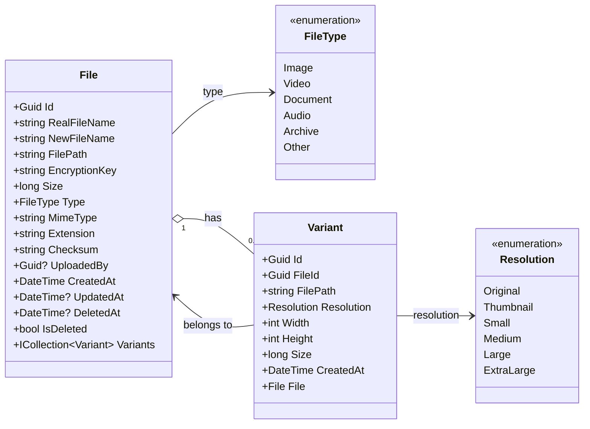

# Files Processor — Class Diagram

> Render this file in an editor/viewer that supports the **Mermaid** extension
> (e.g. VS Code *Markdown Preview Mermaid Support*, GitHub, GitLab, Notion).

## Notes

- **File** holds the metadata of an uploaded, encrypted file. One file can have
  many **Variants** (e.g. resized images / transcoded renditions).
- **Variant** references its parent `File` via `FileId` and points to the
  physical path of the processed rendition, tagged with a `Resolution`.
- **Resolution** is an `enum` listing the resolutions the processor supports.
- **FileType** is a small extra enum that classifies the file so the processor
  can pick the right pipeline (image resizing, video transcoding, etc.).